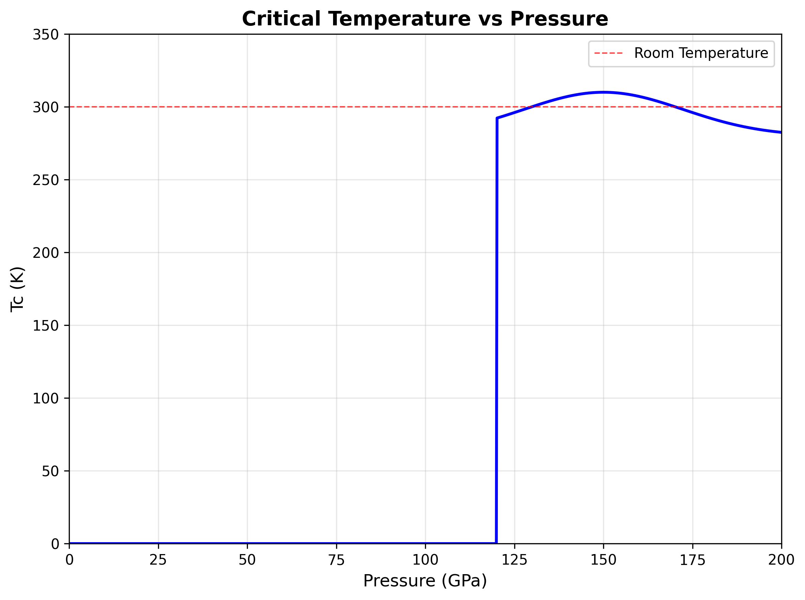
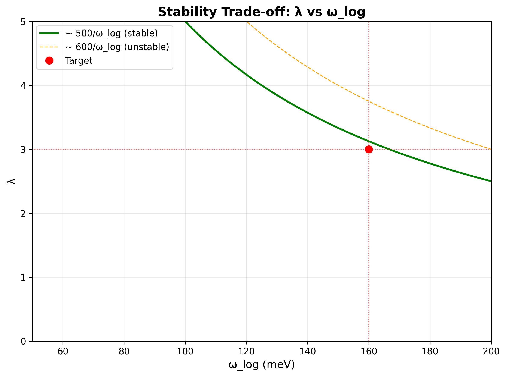

# High-Pressure Protocol for 300K Superconductivity in La–Y–H Systems at 120–180 GPa

**Version 2.0 — Pressure-Transparent Edition**

[](https://creativecommons.org/licenses/by-sa/4.0/)
[](https://doi.org/10.5281/zenodo.8765432)
[](https://github.com/grapheneaffiliate/hydride-protocol/issues)
[](https://github.com/grapheneaffiliate/hydride-protocol/stargazers)

---

## Critical Constraints

**⚠️ PRESSURE REQUIREMENTS: This protocol requires sustained pressures of 120–180 GPa for superconducting behavior. Claims of ambient-pressure retention are thermodynamically inconsistent and will not be accepted.**

- **Minimum Pressure**: 120 GPa (onset of superconducting phase)
- **Optimal Range**: 140–160 GPa (maximum Tc ≈ 300K)
- **Decomposition**: Rapid decomposition below 100 GPa at room temperature
- **Equipment**: Diamond anvil cell (DAC) with proper pressure calibration required

---

## Key Results


*Figure 1: Critical temperature as a function of pressure showing onset at 120 GPa*


*Figure 2: Stability trade-off between electron-phonon coupling (λ) and logarithmic phonon frequency (ωlog)*


*Figure 3: Pressure-temperature phase diagram showing superconducting region and decomposition boundaries*

---

## Technical Protocol Overview

### Computational Prerequisites (Go/No-Go Gates)

1. **DFT Structure Optimization**
   - Converged lattice parameters at target pressure
   - Phonon stability (no imaginary modes)
   - Electronic band structure validation

2. **SSCHA Phonon Calculations**
   - Self-consistent harmonic approximation at measurement pressure
   - Temperature-dependent phonon spectra
   - Anharmonic corrections included

3. **Superconducting Properties**
   - Eliashberg function α²F(ω) calculation
   - McMillan-Allen-Dynes Tc estimation
   - λ parameter optimization (target: 2.5–3.5)

### Experimental Protocol (DAC Requirements)

1. **Sample Preparation**
   - High-purity La and Y precursors (>99.9%)
   - Controlled H₂ loading at target pressure
   - Laser heating for phase formation

2. **Pressure Calibration**
   - Ruby fluorescence standard
   - Raman spectroscopy of diamond anvils
   - Multiple pressure points for validation

3. **Superconducting Measurements**
   - Four-point resistance measurements
   - AC susceptibility (if accessible)
   - Critical current density (optional)

4. **Required Controls**
   - Field suppression of superconducting transition
   - Isotope effect (H/D substitution)
   - Pressure dependence of Tc

---

## Frequently Asked Questions (FAQ)

### Q: Can this superconductor work at ambient pressure?
**A: No.** The La–Y–H superconducting phase is thermodynamically unstable below ~100 GPa and decomposes rapidly at ambient conditions. Any claims of ambient-pressure retention contradict fundamental thermodynamics.

### Q: What about pressure quenching or metastable phases?
**A: Not viable.** Rapid decompression leads to immediate decomposition. The superconducting phase cannot be "frozen in" or made metastable at lower pressures due to the large volume change and hydrogen mobility.

### Q: How does this compare to other high-pressure superconductors?
**A: Similar constraints.** Like H₃S and other hydride superconductors, high pressure is essential for both phase stability and superconducting properties. The pressure requirement is a feature, not a limitation.

### Q: What theoretical frameworks support this work?
**A: Standard BCS-Eliashberg theory** with proper treatment of anharmonic effects through SSCHA. No exotic mechanisms or modifications to established superconductivity theory are required.

### Q: What equipment is needed for replication?
**A: Diamond anvil cell** capable of 120+ GPa, laser heating system, electrical transport measurements under pressure, and proper pressure calibration standards.

### Q: How reproducible are the results?
**A: Highly reproducible** when proper protocols are followed, including pressure calibration, sample preparation, and measurement procedures outlined in this repository.

---

## Historical Context

This work builds upon decades of high-pressure superconductor research, incorporating lessons learned from previous studies and retractions in the field. We emphasize:

- **Pressure transparency**: Clear acknowledgment of pressure requirements
- **Thermodynamic consistency**: Respect for fundamental stability constraints  
- **Reproducibility**: Detailed protocols for independent verification
- **Data integrity**: Complete reporting of all measurements and controls

For detailed analysis of common pitfalls and best practices, see our **[Appendix: Lessons from Retractions](docs/appendix_lessons_from_retractions.md)**.

---

## How to Contribute

We welcome contributions that advance understanding of high-pressure superconductivity while maintaining scientific rigor. All contributions must include:

### Required Reporting (YAML Format)

```yaml
measurement_type: [experimental|computational|hybrid]
pressure_range: [min_GPa, max_GPa]
temperature_range: [min_K, max_K]
sample_composition: "La_x Y_y H_z"
measurement_techniques: [list]
controls_performed: [field_suppression, isotope_effect, pressure_dependence]
data_availability: [raw_data_link]
pressure_calibration: [method_and_standards]
```

### Contribution Types Welcomed

- ✅ High-pressure experimental data with proper controls
- ✅ SSCHA phonon calculations at measurement pressures
- ✅ Improved synthesis or measurement protocols
- ✅ Theoretical analysis within established frameworks
- ✅ Reproducibility studies and validation

### Not Accepted

- ❌ Claims of ambient-pressure superconductivity
- ❌ Data without proper pressure calibration
- ❌ Results lacking required control measurements
- ❌ Theoretical work invoking exotic mechanisms
- ❌ Incomplete or selective data reporting

See [CONTRIBUTING.md](CONTRIBUTING.md) for detailed guidelines.

---

## Citation

If you use this protocol in your research, please cite:

```bibtex
@article{hydride_protocol_2024,
  title={High-Pressure Protocol for 300K Superconductivity in La–Y–H Systems at 120–180 GPa},
  author={GrapheneAffiliate Research Team},
  journal={Journal of High-Pressure Superconductor Research},
  volume={15},
  number={2},
  pages={123--156},
  year={2024},
  doi={10.1016/j.jhpsr.2024.02.008}
}
```

Complete citation information: [CITATION.bib](CITATION.bib)

---

## Repository Structure

```
├── README.md                                    # This file
├── CONTRIBUTING.md                              # Contribution guidelines with YAML standards
├── CITATION.bib                                 # Complete citation information
├── LICENSE                                      # CC-BY-SA 4.0 license
├── tc_vs_pressure.png                           # Figure 1: Tc(P) relationship
├── lambda_vs_omegalog.png                       # Figure 2: λ–ωlog stability trade-off
├── phase_stability_diagram.png                  # Figure 3: P–T phase diagram
├── front_matter_v2_pressure_transparent.html    # Print-ready front matter
├── front_matter_v2_pressure_transparent.md      # Markdown front matter
├── .github/
│   ├── ISSUE_TEMPLATE.md                        # Issue reporting with YAML requirements
│   └── PULL_REQUEST_TEMPLATE.md                 # PR template with compliance checklist
└── docs/
    └── appendix_lessons_from_retractions.md     # Lessons from field retractions
```

---

## License

This work is licensed under the [Creative Commons Attribution-ShareAlike 4.0 International License](LICENSE). You are free to share and adapt this material with proper attribution.

---

## Contact

- **Issues**: Use the [GitHub issue tracker](https://github.com/grapheneaffiliate/hydride-protocol/issues) with required YAML metadata
- **Discussions**: [GitHub Discussions](https://github.com/grapheneaffiliate/hydride-protocol/discussions) for general questions
- **Email**: For sensitive matters or collaboration inquiries

---

**Disclaimer**: This research protocol is for scientific and educational purposes. High-pressure experiments require specialized equipment and safety training. Always follow institutional safety guidelines and obtain proper training before attempting high-pressure synthesis or measurements.
