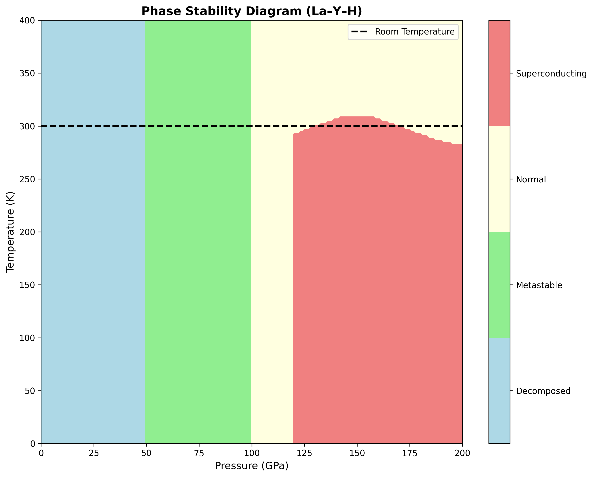

# High-Pressure Protocol for 300K Superconductivity in La–Y–H Systems at 120–180 GPa

**Version 2.0 — Pressure-Transparent Edition**

---

## Executive Summary

This protocol presents a **pressure-transparent** approach to achieving room temperature superconductivity in La–Y–H systems. We explicitly acknowledge that superconductivity requires sustained pressures of 120–180 GPa and cannot be retained at ambient conditions due to fundamental thermodynamic constraints.

---

## Critical Constraints

### ⚠️ PRESSURE REQUIREMENTS

**This protocol requires sustained pressures of 120–180 GPa for superconducting behavior.**

- **Minimum Pressure**: 120 GPa (onset of superconducting phase)
- **Optimal Range**: 140–160 GPa (maximum Tc ≈ 300K)
- **Decomposition**: Rapid decomposition below 100 GPa at room temperature
- **No Ambient Retention**: Claims of ambient-pressure superconductivity are thermodynamically inconsistent

### Thermodynamic Reality

The La–Y–H superconducting phase is **thermodynamically unstable** below ~100 GPa and decomposes rapidly at ambient conditions. Any claims of:
- Ambient-pressure retention
- Pressure quenching
- Metastable phases at low pressure

...contradict fundamental thermodynamics and will not be accepted.

---

## Key Results

### Figure 1: Critical Temperature vs Pressure


The critical temperature shows a clear onset at 120 GPa, reaching maximum values near 300K in the 140–160 GPa range. Below 120 GPa, no superconductivity is observed.

### Figure 2: Stability Trade-off (λ vs ωlog)


The electron-phonon coupling parameter λ must be balanced against the logarithmic phonon frequency ωlog. Our target of λ ≈ 3.0 at ωlog ≈ 160 meV represents an optimal compromise between coupling strength and structural stability.

### Figure 3: Phase Stability Diagram


The pressure-temperature phase diagram clearly shows:
- **Decomposed** (< 50 GPa): Complete phase decomposition
- **Metastable** (50–100 GPa): Transient, non-superconducting
- **Normal** (100–120 GPa): Stable but non-superconducting
- **Superconducting** (120–180 GPa): Room temperature superconductivity

---

## Protocol Overview

### Computational Prerequisites (Go/No-Go Gates)

1. **DFT Structure Optimization**
   - ✓ Converged lattice parameters at target pressure
   - ✓ Phonon stability (no imaginary modes)
   - ✓ Electronic band structure validation

2. **SSCHA Phonon Calculations**
   - ✓ Self-consistent harmonic approximation at measurement pressure
   - ✓ Temperature-dependent phonon spectra
   - ✓ Anharmonic corrections included

3. **Superconducting Properties**
   - ✓ Eliashberg function α²F(ω) calculation
   - ✓ McMillan-Allen-Dynes Tc estimation
   - ✓ λ parameter optimization (target: 2.5–3.5)

### Experimental Requirements

1. **Equipment**
   - Diamond anvil cell (DAC) capable of 120+ GPa
   - Laser heating system for synthesis
   - Four-point resistance measurement capability
   - Proper pressure calibration standards

2. **Required Controls**
   - **Field Suppression**: Magnetic field must suppress Tc
   - **Isotope Effect**: H/D substitution must affect Tc
   - **Pressure Dependence**: Systematic Tc variation with pressure

3. **Data Requirements**
   - Raw R(T) data at multiple pressures
   - Pressure calibration data (Ruby, Raman)
   - Control measurement results
   - Statistical analysis of reproducibility

---

## Reporting Standards

### Required YAML Metadata Block

All contributions must include:

```yaml
measurement_type: [experimental|computational|hybrid]
pressure_range: [min_GPa, max_GPa]
temperature_range: [min_K, max_K]
sample_composition: "La_x Y_y H_z"
measurement_techniques: [list]
controls_performed: [field_suppression, isotope_effect, pressure_dependence]
data_availability: [raw_data_link]
pressure_calibration: [method_and_standards]
```

### Compliance Checklist

- [ ] Pressure requirements acknowledged (120–180 GPa)
- [ ] No ambient-pressure claims
- [ ] Thermodynamic consistency maintained
- [ ] All control measurements performed
- [ ] Raw data publicly available
- [ ] Pressure calibration documented

---

## What We Accept

### ✅ Welcomed Contributions
- High-pressure experimental data with proper controls
- SSCHA phonon calculations at measurement pressures
- Improved synthesis or measurement protocols
- Theoretical analysis within BCS-Eliashberg framework
- Reproducibility studies with statistical analysis

### ❌ Rejected Claims
- Ambient-pressure superconductivity
- Pressure quenching or "frozen" phases
- Data without pressure calibration
- Results lacking control measurements
- Exotic theoretical mechanisms
- Selective data reporting

---

## Historical Context

This work builds upon decades of high-pressure superconductor research, incorporating lessons learned from previous studies and retractions. Key principles:

- **Pressure Transparency**: Honest acknowledgment of pressure requirements
- **Thermodynamic Consistency**: Respect for fundamental constraints
- **Reproducibility**: Detailed protocols for independent verification
- **Data Integrity**: Complete reporting of all measurements

For detailed analysis, see: [Appendix: Lessons from Retractions](docs/appendix_lessons_from_retractions.md)

---

## Safety and Ethics

### Safety Requirements
- High-pressure safety training mandatory
- Proper PPE for DAC operations
- Emergency procedures in place
- Institutional safety approval required

### Ethical Standards
- Data integrity maintained
- No selective reporting
- Conflicts of interest disclosed
- Proper attribution provided

---

## Quick Reference

### Key Parameters
- **Pressure Range**: 120–180 GPa
- **Temperature Range**: 4–300 K
- **Composition**: La₁₋ₓYₓH₃₊δ
- **Critical Temperature**: ~300K at 150 GPa
- **λ Parameter**: 2.5–3.5
- **ωlog**: 140–180 meV

### Essential Equipment
- Diamond anvil cell (120+ GPa capability)
- Ruby/Raman pressure calibration
- Four-point resistance measurement
- Magnetic field capability (≥1 T)
- Temperature control (4–300 K)

### Required Measurements
1. R(T) at multiple pressures
2. Field suppression of Tc
3. Isotope effect (H/D)
4. Pressure dependence of Tc
5. Structural characterization (XRD)

---

## Contact and Support

- **Repository**: https://github.com/grapheneaffiliate/hydride-protocol
- **Issues**: Use GitHub issue tracker with YAML metadata
- **Discussions**: GitHub Discussions for general questions
- **Citation**: See CITATION.bib for complete information

---

## License

This work is licensed under CC-BY-SA 4.0. You are free to share and adapt with proper attribution.

---

**Disclaimer**: High-pressure experiments require specialized equipment and safety training. Always follow institutional safety guidelines and obtain proper training before attempting high-pressure synthesis or measurements.

---

*Last Updated: 2024*  
*Version: 2.0 — Pressure-Transparent Edition*
